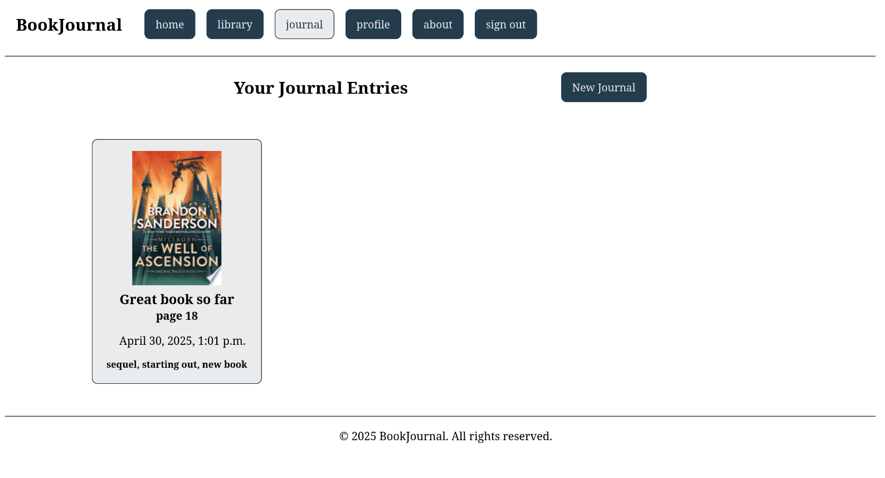

# 📚 BookJournal

**BookJournal** is a full-stack Django web app that allows users to search for books, save them to a personal collection, and write journal entries. It integrates with the Google Books API and provides a clean interface for managing and exploring a personal reading history.

## Screenshots

**Homepage (not logged in)**

**Register**

**Login**

**Homepage (logged in)**

**Search Results**

**Book Details**

**Book Reviews**

**Review**

**New Review**

**Library**

**Journal Home Page**

**New Journal**

**Your Profile**

**Other User Profile**

**

## Features

- Search books using the Google Books API
- Add to your library with persistent storage in PostgreSQL
- Follow your friends
- View detailed book pages including cover, metadata, journal entries, and reviews
- Journal your reading with timestamped entries
- Content-based recommendations based on books you have rated
- Custom password reset flow using Django's Auth system
- Responsive UI built with Bootsrap

## Tech Stack

- **Backend:** Django, Python, PostgreSQL
- **Frontend:** HTML, Bootstrap
- **APIs:** Google Books API

## Future Improvements

- Add user-to-user sharing
- Implement auto-tagging of books, reviews, and journals
- Implement Celery for background processing and scalability
- Dockerize for production deployment
